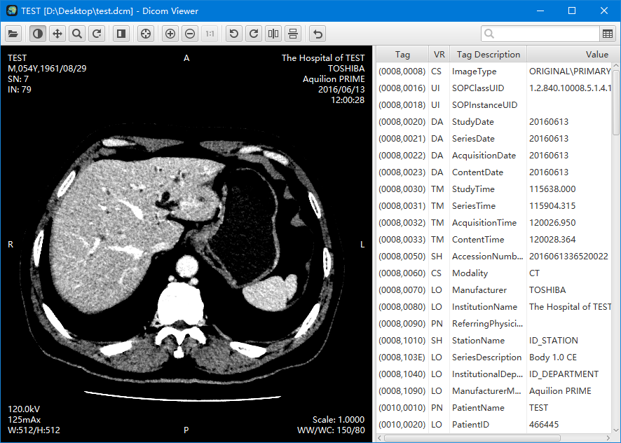

<h1 align="center">DICOM-Viewer <a href="https://github.com/YiiGuxing/dicom-viewer/releases/latest"></h1>

A simple viewer for DICOM files.

Usage
-----

- Download the `.jar` file: [latest releases](https://github.com/YiiGuxing/dicom-viewer/releases/latest).
- Double-click to run (request Java 8).
